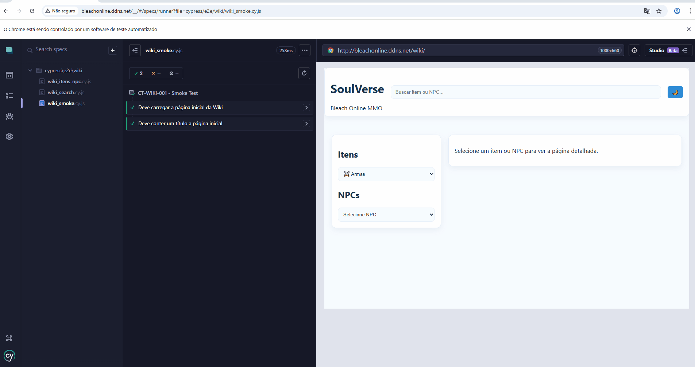

# SoulVerse Wiki - Testes Automatizados

Este projeto contém testes automatizados utilizando **Cypress** para validar funcionalidades da wiki do jogo **SoulVerse (Bleach Online MMO)**.

A wiki utilizada nos testes está disponível em:

http://bleachonline.ddns.net/wiki/

---

# Ferramentas utilizadas

* Cypress
* JavaScript
* Node.js

---

# Escopo dos testes

Os testes automatizados validam funcionalidades principais da wiki:

### CT-WIKI-001

Acesso à página da wiki.

### CT-WIKI-002

Validação se o campo de pesquisa existe.

### CT-WIKI-003

Validação das categorias de itens.

### CT-WIKI-004

Atualização da lista de itens ao trocar categoria.

### CT-WIKI-005

Exibição correta das informações do item dropável e craftado.

### CT-WIKI-006

Validação dos efeitos e atributos do item.

### CT-WIKI-007

Validação dos materiais necessários para fórmulas.

### CT-WIKI-008

Redirecionamento correto de página ao clicar em algum material da fórmula.

### CT-WIKI-009

Exibir informações corretas ao selecionar NPC.

### CT-WIKI-010

Validação da barra de pesquisa.

---

# Estrutura dos testes

```
cypress/
 └ e2e/
    ├ wiki_items.cy.js
    ├ wiki_search.cy.js
    └ wiki_navigation.cy.js
```

---

# Como executar os testes

Instalar dependências:

```
npm install
```

Executar Cypress:

```
npx cypress open
```

Ou executar em modo headless:

```
npx cypress run
```

---

# Evidência da execução

Exemplo de execução dos testes automatizados:



---

# Objetivo

Este projeto foi desenvolvido como parte de um **portfólio de QA Júnior**, demonstrando conhecimentos em:

* Testes manuais
* Automação de testes
* Testes de interface
* Estruturação de cenários de teste
* Organização de repositórios de QA
